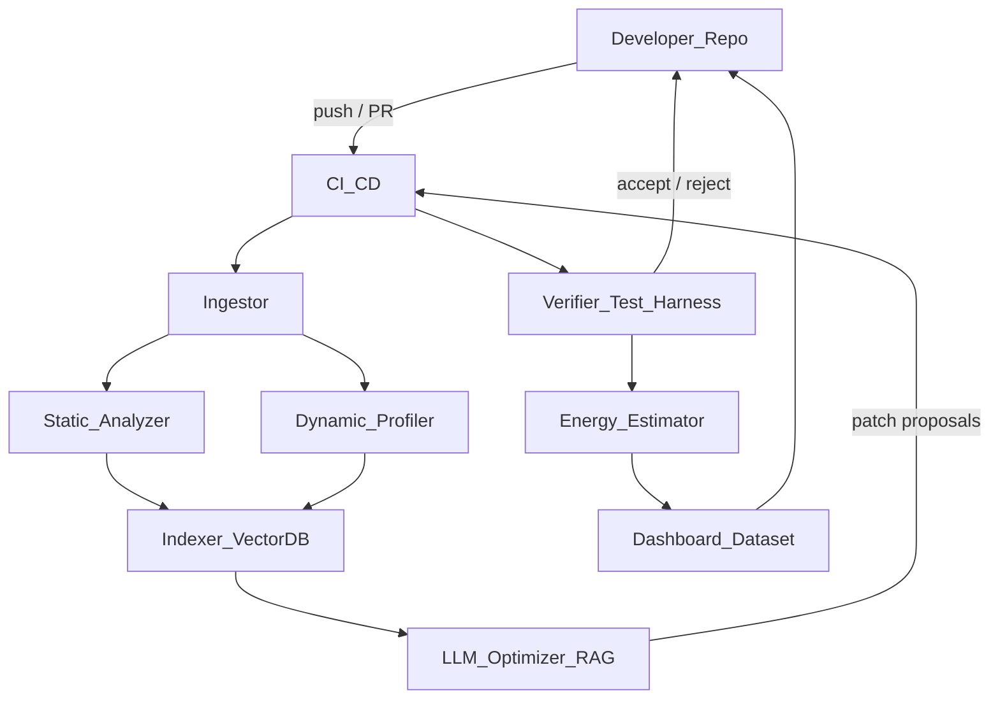
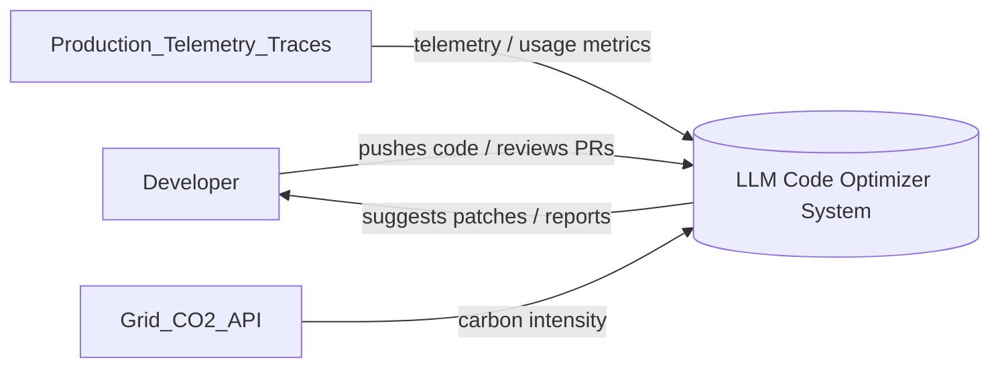
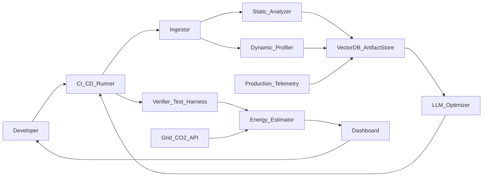
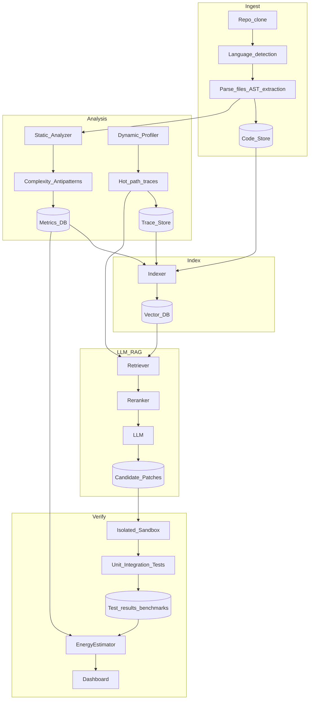

# LLM-driven Code Optimizer for Carbon-Aware Software

> Comprehensive architecture, dataflows (DFD L0-L2), flowchart, modules, APIs, dataset schema, CI/CD, measurement protocol, and evaluation plan for a final-year B.Tech project.

## Purpose and Goals
- Build an LLM-driven pipeline that ingests a codebase, identifies high-energy hotspots, proposes correctness-preserving refactors, verifies them, and demonstrates measured reductions in energy (kWh) and CO2e.
- Emphasis on reproducibility, explainability, human-in-the-loop safety, and research-quality evaluation.

## High-level system overview
- External actors: Developers, CI/CD, Production telemetry, Grid CO2 intensity API.
- Main subsystems: Ingestor, Static Analyzer, Dynamic Profiler, Indexer (Vector DB), LLM Optimizer (RAG + Prompting), Verifier & Test Harness, Energy Estimator, CI/CD integration, Dashboard & Dataset Store.

## Top-level flowchart


## Data Flow Diagrams (DFD)

### DFD Level 0 (Context)


### DFD Level 1 (Major subsystems)


### DFD Level 2 (Internal flows & data stores)


## Component Details

### 1) Ingestor
- Responsibilities: clone repositories, enumerate services/micros, detect language(s), find entrypoints, extract module-level ASTs and comments, collect README and CI configs.
- Inputs: Git URL, commit/PR ID.
- Outputs: ASTs, file metadata, list of tests, initial code-store entries.
- Implementation notes: Use `gitpython` (Python) or CLI; use `tree-sitter` for multi-language parsing.

### 2) Static Analyzer
- Responsibilities: AST/CFG extraction, cyclomatic complexity, data-flow/taint analysis, detect anti-patterns (e.g., frequent sync I/O, nested loops with expensive ops), potential vectorization opportunities.
- Tools: `tree-sitter`, `clang-tidy`, `eslint`, `mypy`, `gofmt`/`go vet`.
- Outputs: list of candidate hotspots with static heuristics and risk scores.

### 3) Dynamic Profiler
- Responsibilities: run microbenchmarks and integration traces to collect CPU time, memory, syscalls, I/O stats, and power readings.
- Measurement techniques:
  - Linux: `perf`, RAPL via `pyRAPL`, eBPF (bcc or libbpf) tracing.
  - macOS: `powermetrics` for sampling CPU/GPU power.
  - Containers: use cgroups to isolate and pin CPU frequencies.
- Outputs: time-series traces, flamegraphs, hot-function list with measured CPU-seconds and energy samples.

### 4) Indexer / Vector DB
- Responsibilities: embed code snippets, tests, trace excerpts, commit messages, and previous refactor examples into vector DB for RAG.
- Embeddings: use code-aware embeddings (OpenAI code embeddings, or local models like Starcoder embeddings / instructor models).
- Storage: Vector DB (FAISS for local, Milvus/Weaviate for scale). Keep artifact store for patch diffs and benchmark results.

### 5) LLM Optimizer (RAG + Patch Generator)
- Responsibilities: retrieve relevant context, generate candidate patches, estimate kWh/CO2 impact, produce rationale and risk score.
- Output schema (JSON):
  {
    "patch": "git-style patch text",
    "target_scope": "file:function or module",
    "estimated_kwh_delta": -0.0023,
    "estimated_co2_delta_kg": -0.0005,
    "confidence": 0.72,
    "risk_score": 0.15,
    "rationale": "explanation",
    "required_tests": ["tests/unit/test_x.py"]
  }
- Prompting: include AST snippet + hot-path profile summary + tests list + constraints (must preserve API, tests must pass).
- Two-tier inference: heavy reasoning on remote LLM, distilled local model for quick candidate generation and scoring in CI.

### 6) Verifier & Sandbox
- Responsibilities: apply patch inside isolated sandbox (container), run unit/integration tests, run benchmarks multiple times, collect power traces, run static analyzers again, compute statistical significance.
- Safety checks: enforce test coverage thresholds, reject if major API changes, run fuzzing for changed modules when feasible.

### 7) Energy Estimator
- Responsibilities: convert measured power/time data into kWh; compute CO2e using grid intensity (per region) or typical factors; estimate per-request or per-run carbon impact.
- Formula: CO2e_kg = kWh * grid_intensity_kgCO2_per_kWh
- Grid intensity source: electricitymap API or cloud provider carbon APIs.

### 8) CI/CD Integration
- Place measurement jobs in `pull_request` pipelines:
  - Baseline benchmark run (N repeats)
  - Apply suggested patch (if auto-PR)
  - Optimized benchmark run (N repeats)
  - Statistical comparison and report artifact
- Gate policy: Require tests pass and energy delta non-negative (or present human approval for trade-offs).

### 9) Dashboard & Dataset Store
- Persist all runs, traces, patches, and metrics into a dataset for training and evaluation.
- UI: Grafana dashboards for time series and aggregate savings; HTML report for each PR showing kWh/CO2 delta and test/latency tradeoffs.

## Data & Schema
- Unit sample (JSON):
```json
{
  "id": "uuid",
  "repo": "repo_url",
  "commit": "sha",
  "scope": "file:function",
  "code_before": "...",
  "code_after": "...",
  "profile_before": {"cpu_seconds": 12.3, "kWh": 0.0012},
  "profile_after": {"cpu_seconds": 10.1, "kWh": 0.0009},
  "tests_passed": true,
  "notes": "refactor description"
}
```

- Index fields for Vector DB: `embedding`, `text_snippet`, `repo`, `commit`, `scope`, `metrics_summary`, `patch_id`.

## Measurement protocol (reproducible research rigour)
1. Fix hardware and environment: Docker image with pinned versions, CPU governors set fixed, disable turbo-boost if possible.
2. Warmup runs: run warmup iterations to stabilize caches and JITs.
3. Repeat N times (N >= 30 recommended for statistical power). Collect raw traces and power samples.
4. Use paired statistical tests (paired t-test or bootstrap) on per-run kWh.
5. Log raw data and compute mean, std, 95% CI, and p-value.

### Example commands (Linux / CI)
```bash
# install pyRAPL and run tests with measurement
pip install pyRAPL pytest-benchmark
python -m pyRAPL --output baseline.csv -m pytest tests/benchmarks --benchmark-min-rounds=5
```

## Prompt templates and RAG strategies
- Retriever input: 5–10 nearest code+trace neighbors, top static heuristics and baseline metrics.
- Prompt skeleton:
  - short system instruction: constraints, goal (minimize kWh while preserving tests/API)
  - context: file AST, hot-lines, traces summary, similar example patches
  - ask: produce a patch (unified diff), estimated kWh delta, tests to run, and explanation.

## LLM Output JSON schema (canonical)
```json
{
  "patch": "--- a/path/file.py\n+++ b/path/file.py\n@@ -10,7 +10,8 @@\n ...",
  "estimated_kwh_delta": -0.0012,
  "confidence": 0.8,
  "risk_score": 0.2,
  "explanation": "Replace naive loop with vectorized op...",
  "recommended_tests": ["tests/unit/test_heavy.py"]
}
```

## CI workflow (high level)
- Baseline job: run tests and baseline measurement.
- Suggestion job: run RAG+LLM and open PR with patch candidate(s) or attach suggestions to existing PR.
- Verify job: apply candidate patch(s) into a sandbox branch, run tests + repeated benchmarks + energy measurement.
- Report job: attach artifact with metrics and decision (+ human approval step if needed).

## Security, Safety, and Governance
- Human-in-loop for high-risk changes (> threshold diff size or > threshold risk score).
- Avoid automatic commits/merges without explicit approvals.
- Sanitize telemetry and avoid sending secrets to external LLMs; use local models or redaction for sensitive code.
- Record audit logs for all generated patches and the LLM prompts/outputs.

## Evaluation plan (for B.Tech thesis)
- Benchmarks: choose 2–4 representative services or microbenchmarks (CPU-bound, I/O-bound, Memory-bound).
- Baseline: measure N runs per workload (N >= 30).
- Interventions: apply optimizer suggestions (automated + manual curated) and measure same.
- Metrics to report: ΔkWh, ΔCO2e (use regional grid factor), Δlatency, ΔCPU-seconds, Δmemory, tests pass rate, maintainability score (SQALE or similar), developer effort estimate.
- Statistical tests: paired t-test or bootstrap for kWh; report effect sizes and CIs.

## Experiments & Ablations
- Ablate: RAG vs LLM-only; remote LLM vs local distilled; heuristics-only vs LLM-assisted.
- Evaluate dataset-size impact: train on 100, 1k, 10k examples (if fine-tuning small local models).
- Failure modes: measure instances where energy improved but latency or error rate worsened; discuss tradeoffs.

## Deployment & Ops
- Use canary / A/B deploy to verify production impact on real traffic.
- Integrate with observability (OpenTelemetry) to measure kWh/request in production.
- Schedule heavy jobs during greener grid hours when appropriate (cost-aware scheduling).

## Project structure suggestion (repo)
- `ingestor/` - repo clone + AST extractors
- `static/` - static analysis rules
- `profiler/` - measurement harness and scripts
- `indexer/` - embeddings and vector DB code
- `llm/` - prompt templates, interface adapters, local model wrappers
- `verifier/` - sandbox runner, test harness, benchmark runner
- `dashboard/` - Grafana/visualization, small web UI
- `dataset/` - stored examples, before/after commits, metrics
- `ci/` - GitHub Actions workflows
- `docs/` - this `ARCHITECTURE.md`, README, evaluation notes

## Example DFD notes and interpretation
- DFD L0 shows the system as a single box interacting with dev, telemetry and grid API.
- DFD L1 splits the system into major subsystems (analysis, RAG, verify).
- DFD L2 details the data persistence and indexing flows (Code Store, Trace Store, Vector DB, Patch Store).

## Appendix A — Example Mermaid sequence (patch lifecycle)


## Appendix B — Quick checklist for reproducible experiments
- Use Docker images with pinned tool versions.
- Pin CPU frequency and disable CPU turbo when possible.
- Use same machine for baseline and optimized runs or well-calibrated cloud instances.
- Collect raw power traces and store them alongside benchmark outputs.
- Run warmups and perform enough repeats; store seeds for randomized workloads.

---

## Next steps (suggested immediate tasks)
- Implement the `ingestor` and static analyzer for your primary target language.
- Add CI workflow to run the measurement harness for PRs (I can scaffold this next).

## Multi-file / Whole-project support

- Project graph and callgraph: the Ingestor must build an interprocedural callgraph and module-dependency graph (language-specific build hooks: Maven/Gradle/Go modules/Cargo/npm). This enables cross-file reasoning and ensures patches preserve cross-module contracts.
- Chunking & retrieval: index at function/method/module granularity and store cross-file edges so Retriever returns related files when a hotspot spans multiple files.
- Atomic multi-file patches: the LLM Optimizer should emit unified multi-file diffs suitable for a single atomic PR; the Verifier applies those diffs atomically in a sandbox and runs the full build/test pipeline before acceptance.
- Build orchestration: the Verifier must reproduce the project's build (containerized) and run integration tests and end-to-end benchmarks; use build caches and reproducible Docker images to ensure stable measurements.

Implementation notes:
- Use language-aware callgraph tools — `pyan`/`pycg` for Python, `go list` + `gopls` for Go, `javac`/Soot for Java, `clang`/LLVM for C/C++ — and store edges in the Indexer as additional vectors/metadata.
- Ensure the Indexer stores `depends_on` relationships and `exposes` (public APIs) per module to enable API-preserving refactor checks.

## ML / AI Project-specific additions

ML projects require extra artifacts and stricter validation. Add these components and rules:

- ML Ingestor extensions:
  - Index training scripts, model config files (YAML/JSON), checkpoints metadata (size, path, commit), dataset manifests, and serving code (Triton/TorchServe/TF Serving).
  - Capture environment specs (CUDA, cuDNN, framework versions) and container images used for training/serving.

- GPU and accelerator profiling (Dynamic Profiler):
  - GPU power and utilization: use `pynvml`/NVML, `nvidia-smi` sampling, DCGM, and NVIDIA Nsight `nsys` traces for kernel-level hotspots.
  - Framework profilers: `torch.profiler`, TensorFlow profiler, Triton metrics; capture kernel timelines and operator-level FLOPs and memory peaks.
  - Host metrics: CPU-seconds, disk I/O, network, and memory — include these in the same trace timeline for alignment.

- ML-aware Indexing & RAG:
  - Embed model metadata (parameters, FLOPs estimate, checkpoint size) alongside code embeddings.
  - Retrieve past refactors for model compression (quantization/pruning), batch/IO optimizations, or operator fusion examples.

- ML Optimizer responsibilities:
  - Suggest accuracy-preserving optimizations: mixed precision (AMP), dynamic/static quantization, pruning, distillation, batch-size tuning, data pipeline caching, and smarter checkpointing.
  - Provide estimated training kWh cost for retraining and expected inference kWh savings — include a simple ROI calculation (training kWh / yearly inference kWh saved).

- ML Verifier & Safety:
  - Mandatory validation on holdout evaluation datasets and drift checks; require metrics (accuracy, F1, AUC) within an allowable delta before accepting model-change patches.
  - Run small-scale retrain or simulated proxy runs when full retrain is infeasible; for heavy changes require a human review and canary testing in production traffic.

- ML CI considerations:
  - Use GPU-enabled CI runners or cloud instances; if unavailable, run estimator proxies (e.g., FLOPs-based cost models) but mark results as approximations.
  - Track lifecycle carbon: include retraining/transfer energy when proposing model replacements and display net CO2 savings over expected deployment horizon.

## ML-specific metrics and evaluation protocol

- Primary metrics: `kWh/epoch`, `kWh/inference`, `CO2e_per_epoch`, `CO2e_per_inference`, validation metric (accuracy, AUC), throughput (samples/s), latency P50/P95.
- Measurement best-practices:
  - Pin GPU clocks if possible; use NVML to sample power at high frequency; align profiler traces with power samples via timestamps.
  - For inference, measure `kWh/request` under representative batching and concurrency settings; for training, measure `kWh/epoch` for full reproducibility.
  - Run repeated trials (N >= 10 for heavy GPU runs if time constrained, N >= 30 for smaller runs) and report means + CI.

## Minor additions to Component Details

- Ingestor: document and store ML artifacts (checkpoint pointers, dataset manifests) and project build manifests.
- Dynamic Profiler: add GPU-profiler adapters and sampling scripts (NVML wrapper) to the `profiler/` module.
- Indexer: include `artifact_type` field (code, trace, checkpoint, dataset_manifest) and `hardware_profile` metadata (GPU type, vCPU count) to enable hardware-aware retrieval.
- LLM Optimizer: add an `ml_safety` flag in output schema when a patch affects training or model checkpoints; require explicit `allow_retrain` approval for high-cost retrains.

---

Updated: multi-file support and ML/AI-specific sections added.


*Generated: ARCHITECTURE specification with flowchart and DFD L0–L2.*
